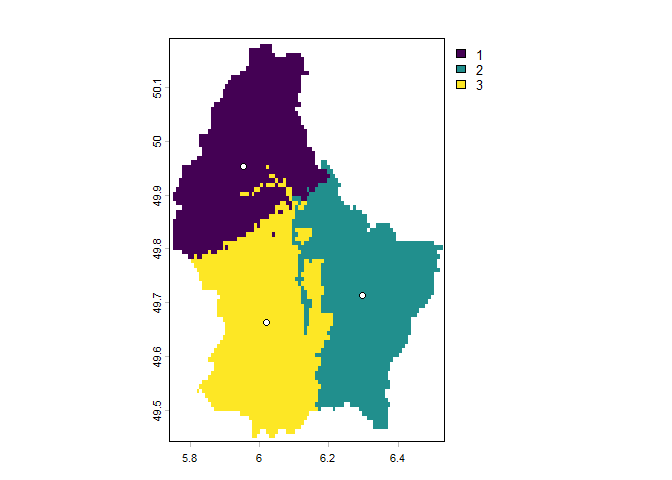

<!-- README.md is generated from README.Rmd. Please edit that file -->

# samplekmeans

The goal of `samplekmeans` is to facilitate data sampling with the
k-means algorithm. Spatial data are the main focus, but other data types
should be covered eventually.

The package is work in progress.

## Installation

Make sure the devtools package is installed first:

``` r
install.packages('devtools')

library(devtools)

install_github("anbm-dk/samplekmeans")
```

## Usage example

Load a raster:

``` r
f <- system.file("ex/elev.tif", package="terra")
r <- rast(f)
```

Run k-means:

``` r
myclusters <- sample_kmeans(
  input = r,
  clusters = 3,
  use_xy = TRUE
  )

plot(myclusters$clusters)
points(
  myclusters$points,
  pch = 21,
  bg = "white"
  )
```

<!-- -->
