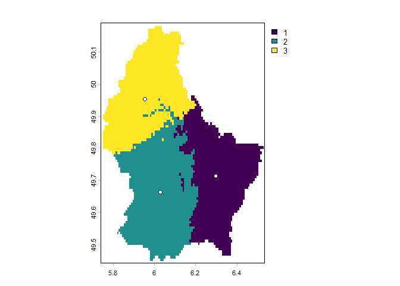

# samplekmeans

<!-- README.md is generated from README.Rmd. Please edit that file -->

The goal of `samplekmeans` is to facilitate data sampling with the
k-means algorithm. Spatial data are the main focus, but other data types
should be covered eventually.

The package is work in progress.

## Installation

Make sure the devtools package is installed first:

``` r
install.packages('devtools')

library(devtools)

install_github("anbm-dk/samplekmeans")
```

## Testing

Run all focused test scripts from the repository root:

``` r
Rscript setup/run_tests.R
```

The test entrypoint discovers and runs all scripts matching
`setup/test_*.R` and prints a pass/fail summary.

## Usage example

Load a raster:

``` r
f <- system.file("ex/elev.tif", package="terra")
r <- rast(f)
```

Run k-means:

``` r
myclusters <- sample_kmeans(
  input = r,
  clusters = 3,
  use_xy = TRUE
  )

plot(myclusters$clusters)
points(
  myclusters$points,
  pch = 21,
  bg = "white"
  )
```

<!-- -->

## Candidate-constrained cluster centers

You can limit where cluster centers are selected by using the
`candidates` argument.

For `data.frame` input, `candidates` is a numeric vector of row indices.
Selected centers are restricted to those rows.

``` r
set.seed(42)

df_input <- data.frame(
  v1 = c(rnorm(30, -4, 0.25), rnorm(30, 0, 0.25), rnorm(30, 4, 0.25)),
  v2 = c(rnorm(30, -4, 0.25), rnorm(30, 0, 0.25), rnorm(30, 4, 0.25))
)

df_candidates <- as.integer(c(1:15, 31:45, 61:75))

myclusters_df <- sample_kmeans(
  input = df_input,
  clusters = 3,
  candidates = df_candidates,
  seed = 7
)

myclusters_df$points
#>   ID Index
#> 1  1    42
#> 2  2    67
#> 3  3    15
```

For point data (`SpatVector` with points), `candidates` can be either a
numeric index vector or a `SpatRaster` mask.

``` r
set.seed(99)

pts_df <- data.frame(
  x = c(runif(40, 0, 1), runif(40, 2, 3), runif(40, 4, 5)),
  y = c(runif(40, 0, 1), runif(40, 2, 3), runif(40, 4, 5)),
  z1 = c(rnorm(40, -3, 0.3), rnorm(40, 0, 0.3), rnorm(40, 3, 0.3)),
  z2 = c(rnorm(40, -3, 0.3), rnorm(40, 0, 0.3), rnorm(40, 3, 0.3))
)

pts_input <- terra::vect(pts_df, geom = c("x", "y"), crs = "EPSG:4326")
pts_candidates <- as.integer(c(1:20, 45:55, 90:100))

myclusters_pts <- sample_kmeans(
  input = pts_input,
  clusters = 3,
  candidates = pts_candidates,
  seed = 11
)

myclusters_pts$points
#>           x          y ID Index
#> 1 4.0172342 4.59700985  1   100
#> 2 2.8191735 2.56777946  2    52
#> 3 0.5488174 0.09068056  3    11
```

If candidates do not cover all clusters, uncovered clusters are removed
and their rows/cells are reassigned to surviving clusters. Cluster IDs
are then renumbered to `1..K`.

You can also enforce a minimum cluster size with `min_cluster_size`.
Clusters with fewer assigned rows/cells than this threshold are removed
and reassigned in the same way.
